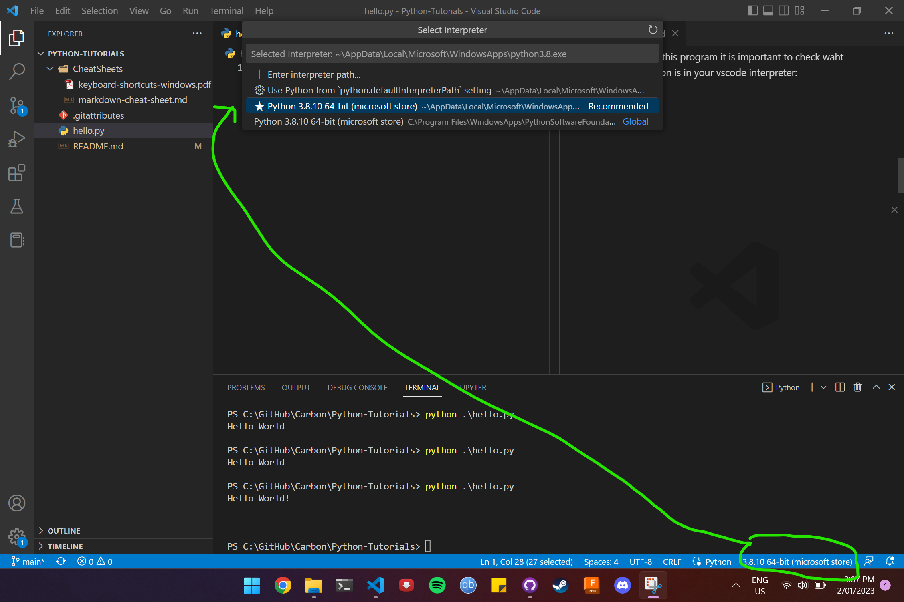
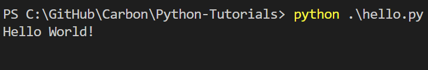
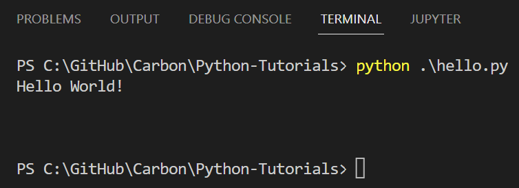

# Python-Tutorials
 Learning Python with Rani
 ## How to begin
 ### This is a test
 #### This is a smaller title
 Hello World

 # PythonTutorials
 This is a collection of test
 scripts used to learn Python

 ## How to begin
 You first need to install these
 items:
 - Vscode
 - Python 3.8 (from the Microsoft
 - Store app)
 - markdown all in one (vscode extensions)

## Hello World
The first tutorial is ons how to create a hello world program. We will callthis "hello.py". The code used to create this tutorial is shown below:
```
print("Hello World!\n\n\n")
Hello World!
```
In order to run this program it is important to check waht version of Python is in your vscode interpreter:



Now that we can confrim that the correct version of Python is being used, we can run the program by opening a new terminal window with "vscode -> terminal" and type the following command:
```
python ./hello.py
```


When you hit enter this will be the result when the program is executed:

